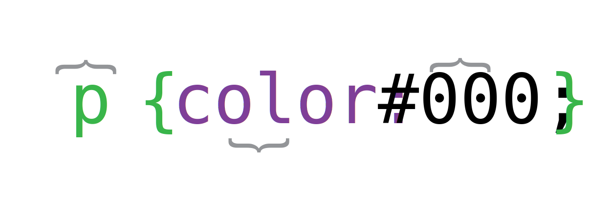

class: center, middle

# What is the difference between a tag and an element?

---
class:

# How do you remove the bullets from an unordered list?

## (general answer :)

```html
<ul>
  <li>Monday</li>
  <li>Tuesday</li>
  <li>Wednesday</li>
</ul>
```

---
class: center, middle

# What might be wrong if your images don't appear when you view the page in a browser?

### There are 3 possible explanations.

---
class: center, middle

# Identify the parts of this declaration.

## (selector, property, value)

### `font: normal 100%/1.5 "Arimo", sans-serif;`

---
class: center, middle

# The box model is made up of?

---
class:

# Positioning methods?

### (static, relative, absolute, fixed)

## - Positions the element relative to the containing block.
## - Removes the element from normal flow.
## - Always positions the element relative to the viewport.
## - Positions the element in normal flow.

---
class: center, middle

# What does the CSS acronym stand for?

---

class: center

# HTML or CSS?

### - content
### - appearance
### - “what something is”
### - “how something looks”
### - semantic markup of data
### - rules for appearance of content

---

class: center, middle

# Explain why CSS has several advantages over alternative methods of determining the appearance of web pages.

---

class: center, middle

# Talk about several ways in which styles<br>can be applied to web pages.

---

class: center, middle

# What's wrong with this markup?

```html
<link type="stylesheet" src="css/main.css">
```

---

class:

# Identify all parts of the CSS syntax.



---

class: center, middle

# What's the syntax for CSS comments?

---

class: center, middle

# What CSS selectors have you studied so far?

---

class: center, middle

# Explain the concept of CSS inheritance in your own words.

---

class: center, middle

# Discuss a practical application of CSS inheritance.
